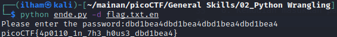

# How to slove this

source code: https://play.picoctf.org/practice/challenge/166?category=5&page=1

1. Download file <i>"ende.py", "flag.txt.en",</i> dan <i>"pw.txt"</i>.
2. Run menggunakan terminal.
   ```bash
   python ende.py
   ```
   atau
   ```bash
   python3 ende.py
   ```
   maka, akan muncul pemberitahuan:
    

   -e : enkripsi <br>
   -d : dekripsi

3. Run sesuai perintah yang muncul pada terminal.
   ```bash
   python ende.py -d flag.txt.en
   ```
   atau
   ```bash
   python3 ende.py -d flag.txt.en
   ```
4. Apabila berhasil, maka langkah selanjutnya adalah memasukkan password.
   
5. Buka file *pw.txt* untuk mengetahui passwordnya. Pembukaan file dapat dilakukan pada *text editor* atau melalui *CLI (Command Line Interface)*. <br>
   Perintah menggunakan *CLI*.
   ```bash
   cat pw.txt
   ```
6. Kemudian masukkan password tersebut.
   

### Flag
>picoCTF{4p0110_1n_7h3_h0us3_dbd1bea4} 
