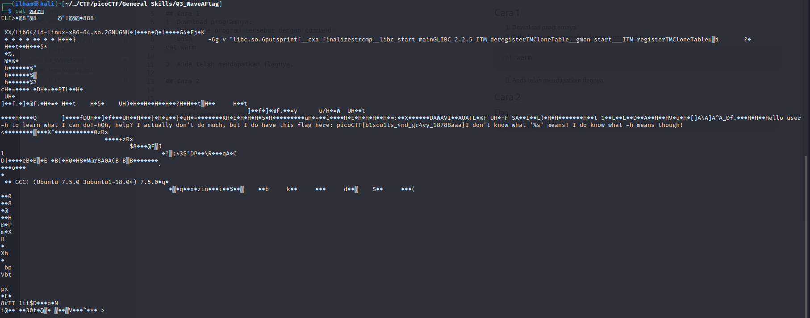
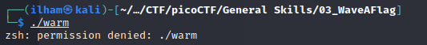
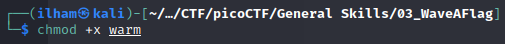
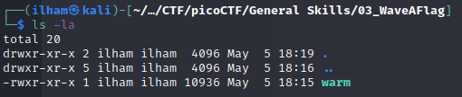
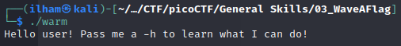
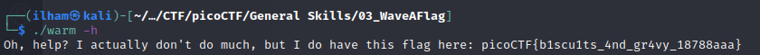

# How to slove this

URL soal: https://play.picoctf.org/practice/challenge/170?category=5&page=1

## Cara 1
1. Download programnya.
2. Buka file program tersebut dengan command.
```bash
cat warm
```
3. Anda telah mendapatkan flagnya.

## Cara 2
1. Download programnya.
2. Jalankan program bash tersebut.<br>
 <br>
Terlihat bahwa tidak dapat menjalankan program tersebut karena *permission denied*.
3. Ubah *permission* agar dapat dicompile.<br>
<br>
Untuk memastikan file dapat eksekusi, cek file system pada file. <br>
**Gambar Sebelum**<br>
<br>
**Gambar Sesudah Ditambah Permission Execution**<br>
 <br>
4. Lakukan eksekusi pada file tersebut.<br>
<br>
Terlihat mengembalikan pesan untuk menambahkan "-h" saat melakukan compile.
5. Lakukan compile dengan menambahkan "-h".
<br>
"-h" and "--help" are the most common arguments to give to programs to get more information from them!<br>
Not every program implements help features like -h and --help.

### Flag
>picoCTF{b1scu1ts_4nd_gr4vy_18788aaa}
