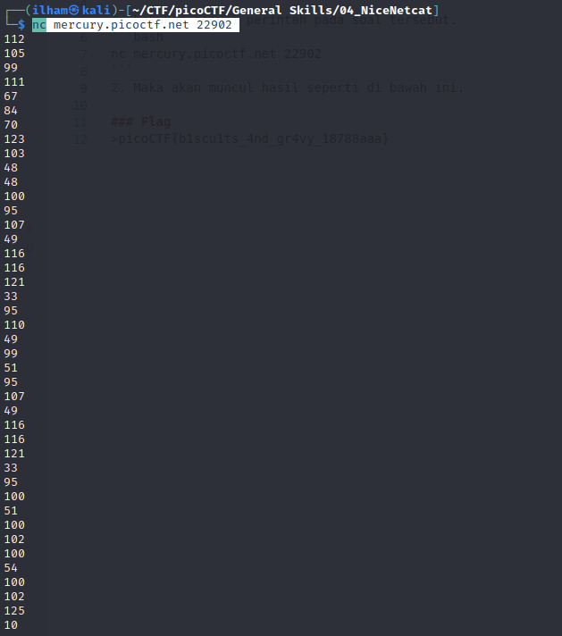
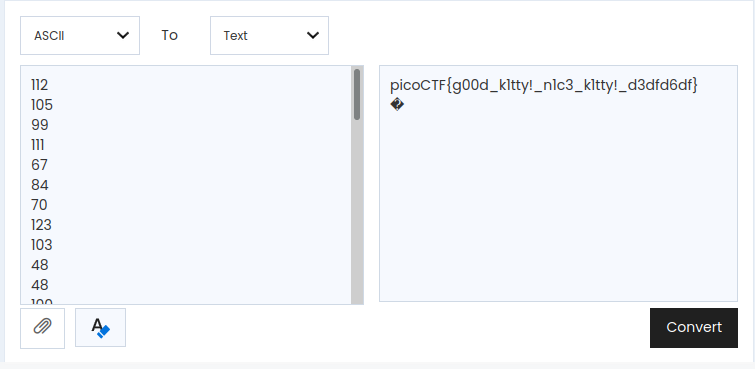

# How to slove this

URL soal: https://play.picoctf.org/practice/challenge/156?category=5&page=1

1. Lakukan sesuai perintah pada soal tersebut.
```bash
nc mercury.picoctf.net 22902 
```
2. Maka akan muncul hasil seperti di bawah ini.<br>

3. Di sini saya curiga bahwa ini merupakan decimal in ASCII. Oleh karena itu saya convert desimal ASCII tersebut menggunakan conventer online. Berikut hasilnya.<br>


### Flag
>picoCTF{g00d_k1tty!_n1c3_k1tty!_d3dfd6df}