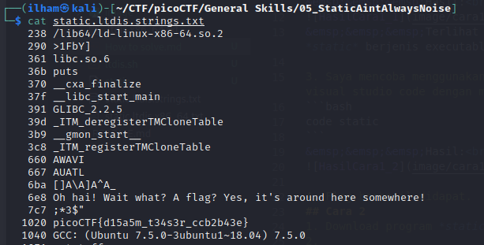

# How to slove this

URL soal: https://play.picoctf.org/practice/challenge/163?category=5&page=1

## Cara 1
1. Download programnya *static*.
2. Coba lihat isi file dengan menggunakan command.
```bash
cat static
```
&emsp;&emsp;&emsp;Hasil:<br>
<br>
&emsp;&emsp;&emsp;Terlihat tidak bisa melihat isi file karena file *static* berjenis executable.<br>

3. Saya mencoba menggunakan code editor. Di sini saya menggunakan visual studio code dengan menggunakan command.
```bash
code static
```
&emsp;&emsp;&emsp;Hasil:<br>


4. Flag berhasil didapat.
## Cara 2
1. Download program *static* dan *BASH script*.
2. Dikarenakan *static* file merupakan executable file, maka coba eksekusi dengan command.
```bash
./static
```
3. Berikut merupakan hasilnya.<br>
<br>
4. Coba buka dan eksekusi file script *ltdis.sh*.


5. Dari langkah sebelumnya kita mendapatkan petunjuk pada bagaian *Usage*. Oleh karena itu, saya mencoba untuk mengeksekusi sesuai perintah.

Setelah menjalankan perintah di atas, kita mendapatkan beberapa file seperti berikut.

6. Di sini saya mencoba membuka file .txt.

7. Flag berhasil didapat.


### Flag
>picoCTF{d15a5m_t34s3r_ccb2b43e}