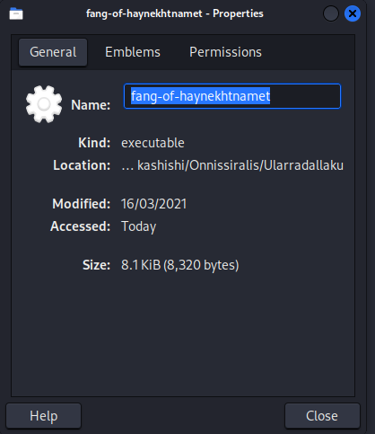
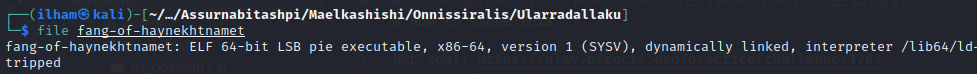

# How to slove this

URL soal: https://play.picoctf.org/practice/challenge/176?category=5&page=1

## Cara 1
1. Download programnya file *Addadshashanammu.zip*.
2. Lakukan unzip pada file tersebut dengan command.
```bash
unzip Addadshashanammu.zip
```
3. Kemudian explore direktori hasil unzip.
4. Disini saya mendapatkan file executable *fang-of-haynekhtnamet*.
5. Lakukan eksekusi pada file tersebut dengan command berikut.
```bash
./fang-of-haynekhtnamet
```
6. Flag berhasil didapatkan.

<hr>
<i><b>NOTE</b></i><br>

--**Cara Mengetahui Jenis File**--

**Cara 1**
1. Klik kanan file tersebut.
2. Klik <i>properties</i>.
3. Cek <i>kind</i> file tersebut. <br>


**Cara 2**
1. Lakukan pengecekan dengan command <i>file "namafile"</i>.
```bash
file fang-of-haynekhtnamet
```
2. Terdapat keterangan bahwa file tersebut merupakan "ELF 64-bit LSB pie executable, x86-64, version 1 (SYSV), dynamically linked, dll"/<br>

<hr>


### Flag
>picoCTF{l3v3l_up!_t4k3_4_r35t!_d32e018c}