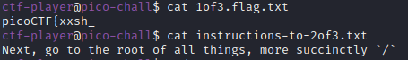

# How to slove this

URL soal: https://play.picoctf.org/practice/challenge/189?category=5&page=1

1. Launch instance kemudian akan muncul *"challenge endpoints"*.
2. Lakukan koneksi dengan *"challenge endpoint*" yang telah muncul. 

3. Login via `ssh` as `ctf-player` with the password, `abcba9f7`.
4. Lakukan `ls -la` untuk mengetahui list filenya. 

5. Lihat isi kedua file tersebut. 

6. Lakukan langkah-langkah sesuai dengan petunjuk yang ada. 
 
 
 

<i><b>NOTE</b></i> 

 **SSH**

 Secure Shell (SSH) adalah protokol jaringan kriptografi yang digunakan untuk koneksi terenkripsi antara klien dan server. SSH client membuat koneksi aman ke SSH server pada mesin jarak jauh. Koneksi terenkripsi dapat digunakan untuk menjalankan perintah di server, tunneling X11, port forwarding, dan banyak lagi.

 Infromasi lebih lanjut:https://www.linuxid.net/32215/penjelasan-perintah-ssh-di-terminal-linux/

### Flag
>picoCTF{xxsh_0ut_0f_\/\/4t3r_21cac893}