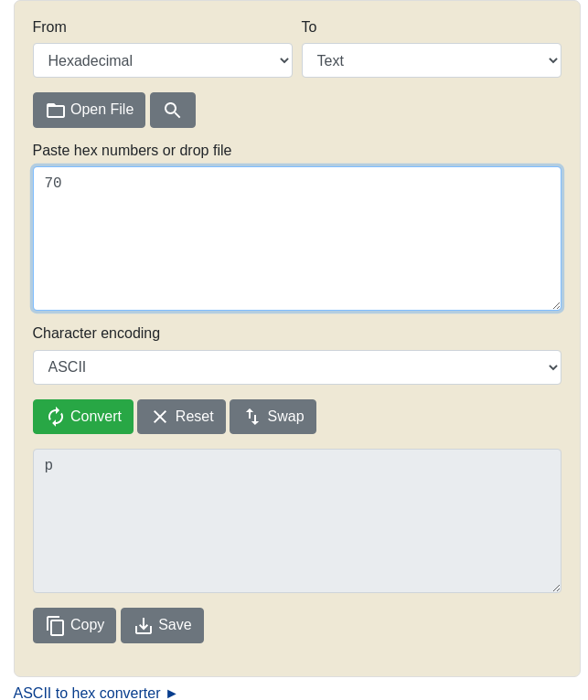

# How to slove this

URL soal: https://play.picoctf.org/practice/challenge/22?category=5&page=1

1. Translake kode 0x70 ke ASCII character dengan menggunakan converter di internet.
2. Berikut merupakan hasilnya. 

3. Flag berhasil didapat.

### Flag
>picoCTF{p}