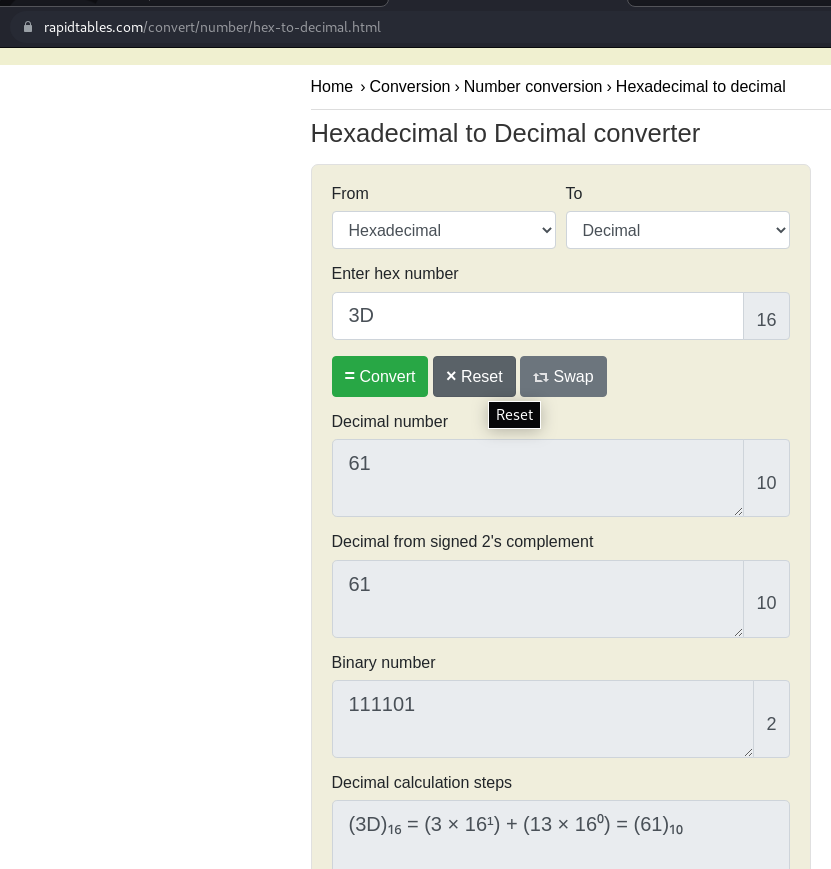

# How to slove this

URL soal: https://play.picoctf.org/practice/challenge/58?category=5&page=1

1. Translate 0x3D base16 (hexadecimal number) ke base10 (decimal number).
2. Berikut merupakan hasilnya. 

3. Flag berhasil didapat.

### Flag
>picoCTF{61}