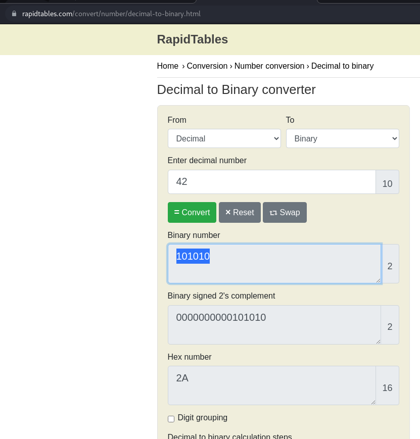

# How to slove this

URL soal: https://play.picoctf.org/practice/challenge/86?category=5&page=1

1. Convert number 42 (base10) ke binary (base2) menggunakan converter di internet.
2. Berikut merupakan hasilnya. 

3. Flag berhasil didapat.

### Flag
>picoCTF{101010}