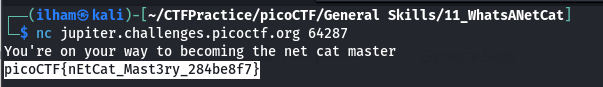

# How to slove this

URL soal: https://play.picoctf.org/practice/challenge/34?category=5&page=1

1. Sambungkan link dan port sesuai deskripsi soal dengan terminal.
```bash
nc jupiter.challenges.picoctf.org 64287
```
2. Berikut merupakan hasilnya.<br>

3. Flag berhasil didapat.

### Flag
>picoCTF{nEtCat_Mast3ry_284be8f7}