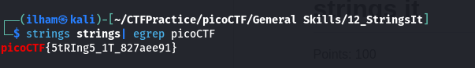

# How to slove this

URL soal: https://play.picoctf.org/practice/challenge/37?category=5&page=1

1. Karena tidak boleh di eksekusi maka disini saya mencoba membuka file dengan cat namun, disini saya tidak bisa membacanya karena terlalu banya output.
2. Lalu saya membuka menngunakna text editor dan mencari flag dengan kata kunci *picoCTF* dan saya mendapatkannya.
3. Cara lain adalah menggunakan perintah `strings` di terminal. Perintah ini mirip dengan `cat`. Perbedaannya `cat` mencetak apa adanya sesuai isi file, sedangkan `strings` mencetak string saja dan outpunya juga bertipe binary file.
4. Kita dapat menggunakan perintah di bawah ini mencari file pada file strings.
```bash
strings strings | egrep picoCTF
```

### Flag
>picoCTF{5tRIng5_1T_827aee91}