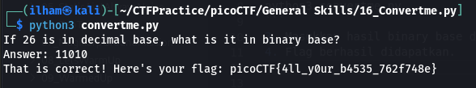

# How to slove this

URL soal: https://play.picoctf.org/practice/challenge/239?category=5&page=2

1. Download python script.
2. Run script python tersebut dengan command berikut.
```bash
python3 convertme.py
```
3. Masukkan hasil binary base dari 26 (base10).<br>

4. Flag berhasil didapatkan.

### Flag
>picoCTF{4ll_y0ur_b4535_762f748e}