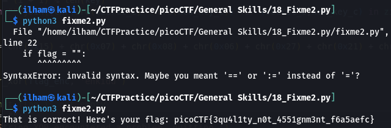

# How to slove this

URL soal: https://play.picoctf.org/practice/challenge/241?category=5&page=2

1. Download python script pada deskripsi soal.
2. Lakukan run terhadap scipt tersebut.
3. Lakukan debug, karena terdapat syntax error pada line 22 yang seharusnya "==" bukan "=".
4. Run script kembali.
5. Flag berhasil didapat. 

### Flag
>picoCTF{3qu4l1ty_n0t_4551gnm3nt_f6a5aefc}