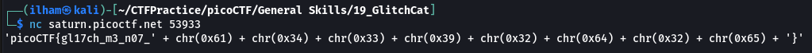
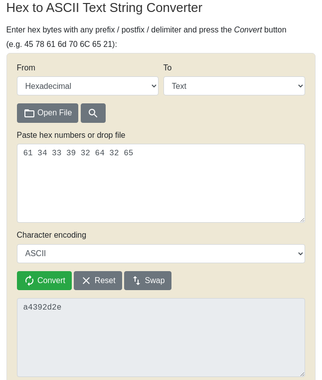

# How to slove this

URL soal: https://play.picoctf.org/practice/challenge/242?category=5&page=2

1. Lakukan perintah sesuai dengan deskripsi soal.
2. Hasilnya berikut. 

3. Karena terdapat karakter flag masih dalam bentuk hexadecimal, maka saya convert kode tersebut ke ascii character. 

4. Flag berhasil didapat.
### Flag
>picoCTF{gl17ch_m3_n07_a4392d2e}