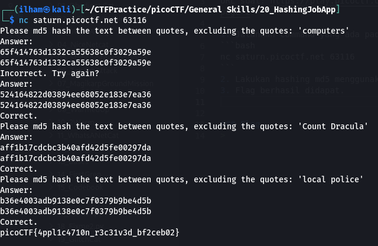

# How to slove this

URL soal: https://play.picoctf.org/practice/challenge/243?category=5&page=2

1. Jalankan command yang ada pada deskripsi soal ke terminal.
```bash
nc saturn.picoctf.net 63116
```
2. Lakukan hashing md5 menggunakan converte online.
3. Flag berhasil didapat.


### Flag
>picoCTF{4ppl1c4710n_r3c31v3d_bf2ceb02}