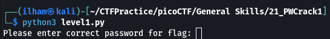
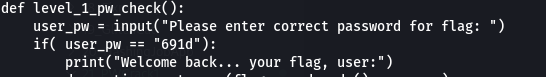
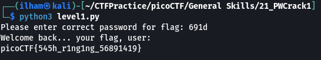

# How to slove this

URL soal: https://play.picoctf.org/practice/challenge/245?category=5&page=2

1. Download kedua file dan tempatkan pada direktori yang sama.
2. Run code `level1.py`.  

3. Karena disuruh memasukkan password, coba untuk membuka file `level1.flag.txt.enc` dan file `level1.py`. Dan terdapat petunjuk untuk password yang digunakan pada file `level1.py`.  

4. Isi password dan flag berhasil didapatkan.  

### Flag
>picoCTF{545h_r1ng1ng_56891419}