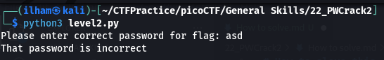

# How to slove this

URL soal: https://play.picoctf.org/practice/challenge/246?category=5&page=2

1. Download kedua file.
2. Run code `level2.py`.
3. Isi password dengan sembarang.  

4. Buka file `level2.py`.  

5. Ubah dari hexadecimal ke bentuk text ASCII.  

6. Isi passwordnya dan flag berhasil didapatkan.  

### Flag
>picoCTF{tr45h_51ng1ng_9701e681}