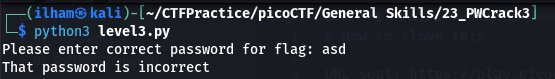
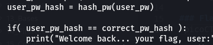
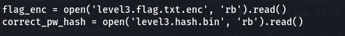
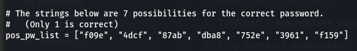
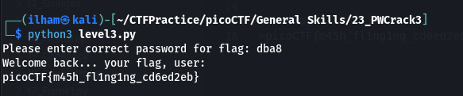

# How to slove this

URL soal: https://play.picoctf.org/practice/challenge/247?category=5&page=2

1. Download semua file yang di deskripsi soal.
2. Run code `level3.py`.
3. Dikarenakan meminta password isi dengan sembarang.  

4. Buka file `level3.py`.  
  

5. Terdapat 7 kemungkinan password untuk mendapatkan namun, hanya satu yang benar. Di sini saya mencoba satu-satu.   

6. Flag berhasil didapatkan.  

### Flag
>picoCTF{m45h_fl1ng1ng_cd6ed2eb}