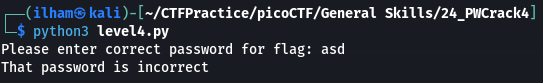
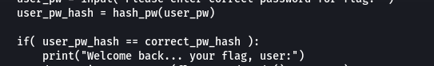
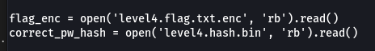
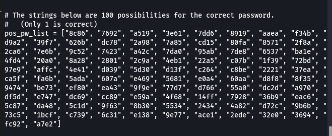
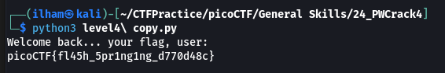

# How to slove this

URL soal: https://play.picoctf.org/practice/challenge/248?category=5&page=2

1. Download semua file yang ada di deskripsi soal.
2. Run code `level4.py` dan isi password dengan sembarang.  

3. Buka kode `level4.py`. Terdapat petunjuk seperti gambar di bawah ini.
  
  

4. Ubah kode dari `level4.py` menjad seperti pada file `level4 copy.py`.
5. Run code `level4 copy.py` dan flag berhasil didapatkan.  

### Flag
>picoCTF{fl45h_5pr1ng1ng_d770d48c}