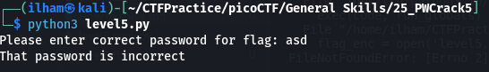

# How to slove this

URL soal: https://play.picoctf.org/practice/challenge/249?category=5&page=3

1. Download semua file yang ada di deskripsi soal.
2. Run code `level5.py` dan isi password dengan sembarang.  

3. Lihat code `level5.py` dan di sini saya mendapatkan petunjuk.  
  

4. Gunakan teknik *brute force* untuk mencoba password satu persatu yang ada di file `dictionary.txt` ke file `level5.py` dengan merubah codingan menjadi seperti file `level5 copy.py`.  
_Gener_25.png)
5. Run code `level5 copy.py` dan flag berhasil didapatkan.  

### Flag
>picoCTF{h45h_sl1ng1ng_36e992a6}