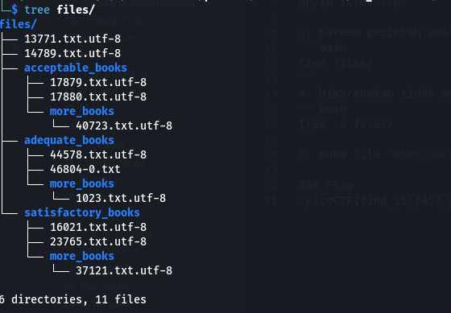
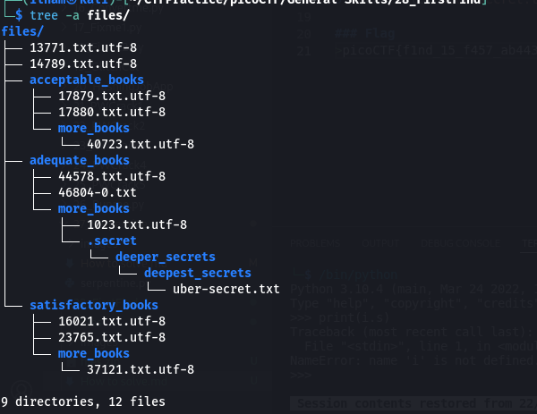
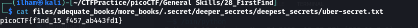

# How to slove this

URL soal: https://play.picoctf.org/practice/challenge/320?category=5&page=3

1. Download python script yang ada di deskripsi soal.
2. Lakukan unzip pada soal tersebut dengan command berikut.
```bash
unzip files.zip
```
3. Karena perintah soal adalah menemukan file `uber-secret.txt` maka di sini saya menggunakan command berikut.
```bash
tree files/
```

4. Dikarenakan tidak ada file`ubser-secret.txt`, maka saya menggunakan perintah di bawah ini untuk melist file dan direktori termasuk yang tersembunyi.
```bash
tree -a files/
```

5. Buka file `uber-secret.txt` dan flag berhasil didapatkan. <br>


### Flag
>picoCTF{f1nd_15_f457_ab443fd1}