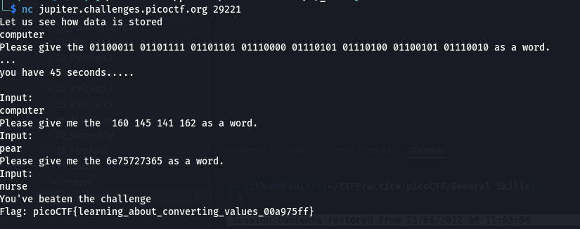

# How to slove this

URL soal: https://play.picoctf.org/practice/challenge/35?category=5&page=3

1. Lakukan sesuai dengan perintah soal.
```bash
nc jupiter.challenges.picoctf.org 29221
```
2. Lakukan convert dari binary ke ASCII character.
3. Lakukan convert dari oktal ke ASCII character.
4. Lakukan convert dari hexadecimal ke ASCII character. <br>

5. Flag berhasil didapatkan.

### Flag
>picoCTF{learning_about_converting_values_00a975ff}