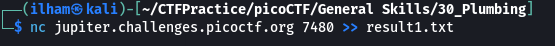

# How to slove this

URL soal: https://play.picoctf.org/practice/challenge/48?category=5&page=3

1. Lakukan sesuai dengan perintah soal.
```bash
nc jupiter.challenges.picoctf.org 29221
```
 <br>

2. Namun respon yang dihasilkan banyak jadi di sini kita dapat menggunakan beberapa skenario seperti berikut. <br>
**Cara Manual** <br>
 <br>
 <br>
**Cara Pipe1** <br>
 <br>
**Cara Pipe2** <br>


### Flag
>picoCTF{digital_plumb3r_06e9d954}