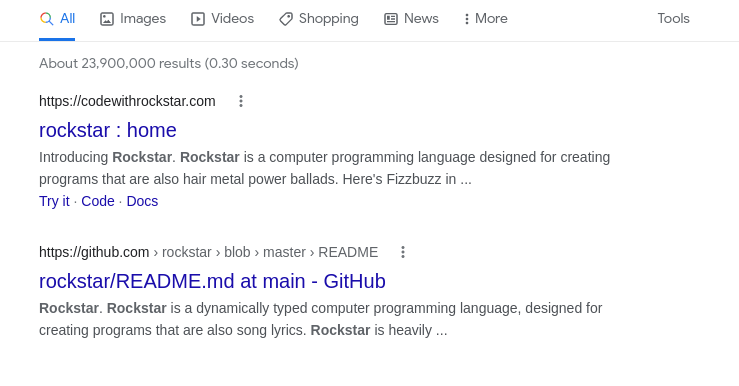
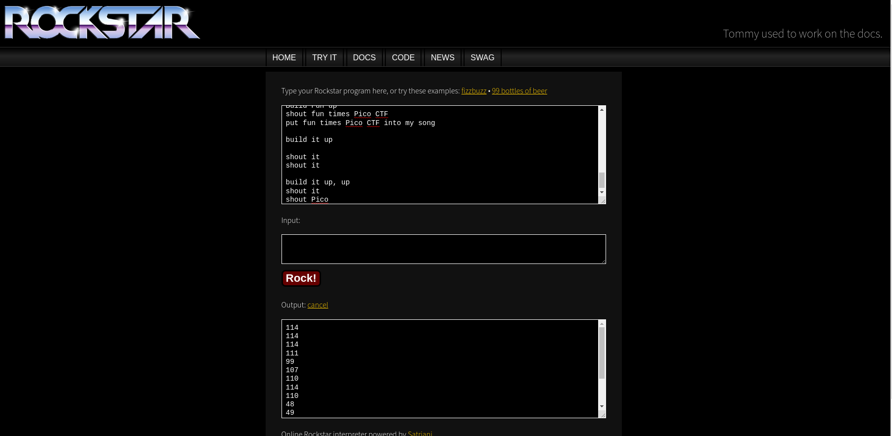
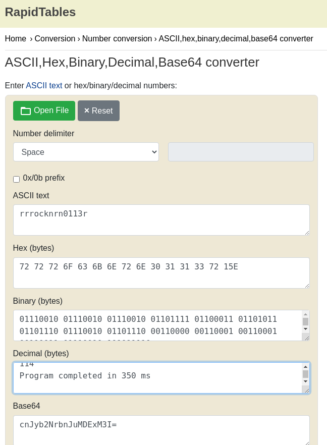

# How to slove this

URL soal: https://play.picoctf.org/practice/challenge/15?category=5&page=3

1. Download file yang ada di deskripsi soal.
2. Saat dibuka file tidak terdapat flag sama sekali.
3. Di sini saya melakukan searching terkait `master rockstar` sesuai yang ada pada *hint*.  

4. Ternyata *rockstar* merupakan programming language di mana bahasa ini menghasilkan output UTF-8. Masukkan lyrics ke dalam *rockstar* interpreter.  

5. Setelah lyric dimasukkan ke dalam *rockstar* interpreter dihasilkan output decimal ascii.
6. Lakukan convert dari decila ke ascii character.  

7. Flag berhasil didapatkan.

### Flag
>picoCTF{rrrocknrn0113r}