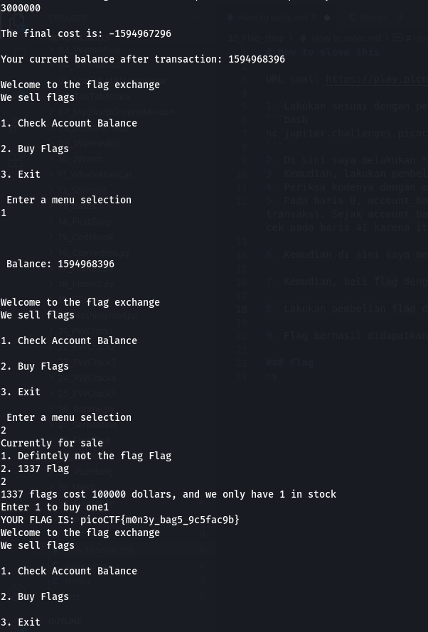

# How to slove this

URL soal: https://play.picoctf.org/practice/challenge/49?category=5&page=3

1. Lakukan sesuai dengan perintah deskripsi soal.
```bash
nc jupiter.challenges.picoctf.org 4906
```
2. Di sini saya melakukan *check balance* dengan hasilnya adalah 1100.
3. Kemudian, lakukan pembelian flag, tapi ternyata tidak cukup.
4. Periksa kodenya dengan mendownload. Link terdapat pada deskripsi soal.
5. Pada baris 8, account_balance adalah bilangan bulat yang ditandatangani, diinisialisasi ke 1100. Pada baris 42, akun_saldo diperbarui setelah transaksi. Sejak account_balance ditandatangani, dimungkinkan untuk melimpahkan bilangan bulat ini, membuatnya menjadi angka negatif. Ini akan melewati cek pada baris 41 karena itu adalah angka negatif, dan menambahkan kredit ke account_balance. <br>

 <br>


6. Kemudian di sini saya membeli dengan mencoba memasukkan nilai integer maksimal. Dan ternyata berhasil. <br>

 <br>
7. Kemudian, beli flag dengan pilihan yang nomor satu dan masukkan nilai 3,000,000 agar nilai negatif yang dihasilkan besar. <br>

 <br>
8. Lakukan pembelian flag dengan pilihan *1337 flag*. <br>

 <br>

9. Flag berhasil didapatkan.

### Flag
>picoCTF{m0n3y_bag5_9c5fac9b}