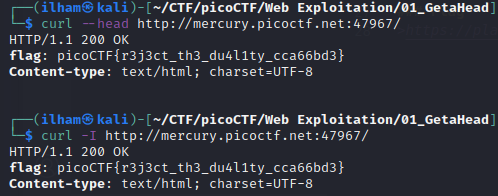
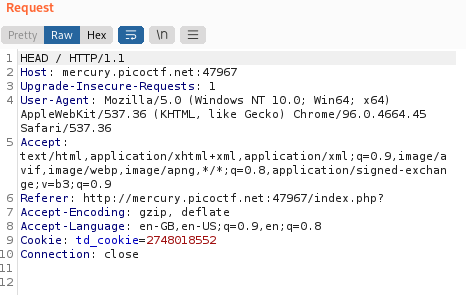
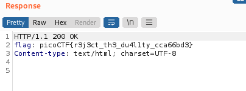

# How to slove this

URL soal: https://play.picoctf.org/practice/challenge/132?category=1&page=1

## Cara 1
1. Buka alamat web soal, yaitu http://mercury.picoctf.net:47967/
2. Coba cek-cek apakah ada yang aneh. Dan saat saya melihat source code ternyata terdapat dua HTTP method (GET dan POST).
3. Terdapat petunju pada judul soal, yaitu HEAD.
```bash
curl --head http://mercury.picoctf.net:47967/
```
atau
```bash
curl --I http://mercury.picoctf.net:47967/
```
<aside>
<i><b>NOTE</b></i><br>
-I, --head</br>
(HTTP FTP FILE) Fetch the headers only! HTTP-servers feature the command HEAD which this uses to get nothing but the header of  a document.  When  used  on an FTP or FILE file, curl displays the file size and last modification time only.
</aside>

4. Flag berhasil didapatkan.<br>



## Cara 2
1. Buka alamat web soal, yaitu http://mercury.picoctf.net:47967/
2. Buka tool Burp Suite.
3. Pilih menu proxy dan pastikan "Intercept is on".
4. Kirim request ke menu repeater.
5. Ubah HTTP method sesuai petunjuk (HEAD) sesuai judul soal.</br>

6. Klik "Send"
7. Flag berhasil didapat. </br>

<aside>
<i><b>NOTE</b></i><br>
Header HTTP adalah pasangan nama atau nilai yang ditampilkan dalam pesan permintaan dan respons dari header pesan untuk Hypertext Transfer Protocol (HTTP). Biasanya, nama header dan nilainya dipisahkan oleh tanda titik dua. Header HTTP adalah bagian integral dari permintaan dan respons HTTP. Dalam istilah yang lebih sederhana, header HTTP adalah kode yang mentransfer data antara server Web dan browser. Header HTTP terutama ditujukan untuk komunikasi antara server dan klien di kedua arah.
</aside>

### Flag
>picoCTF{r3j3ct_th3_du4l1ty_cca66bd3}