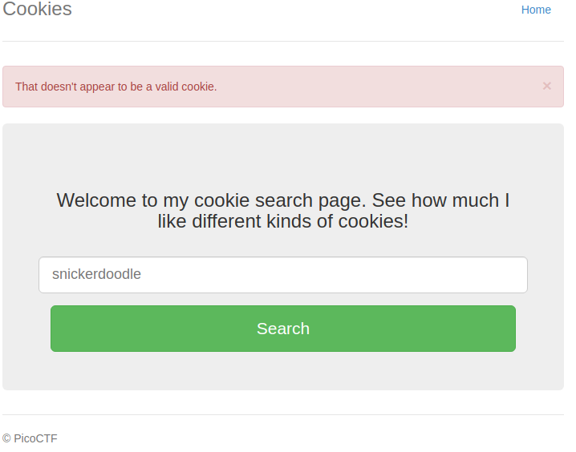
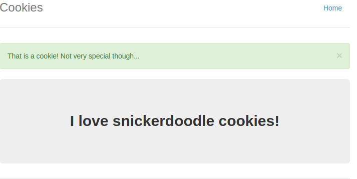
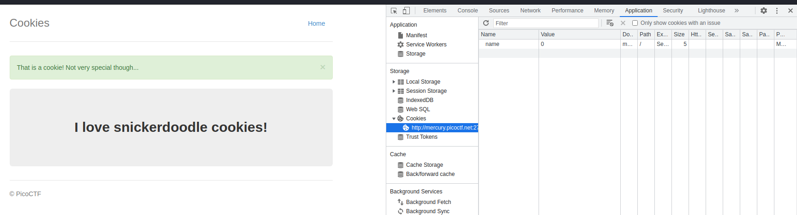
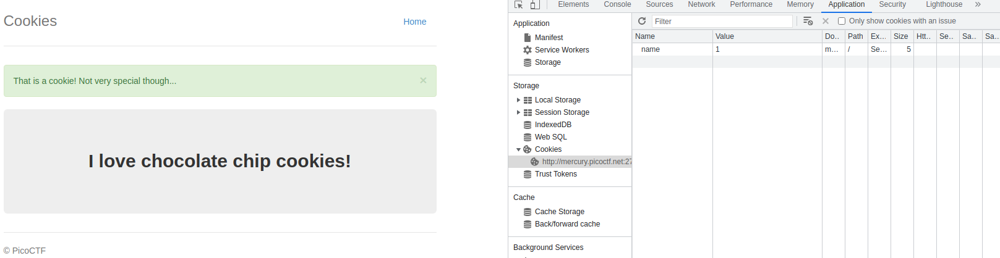
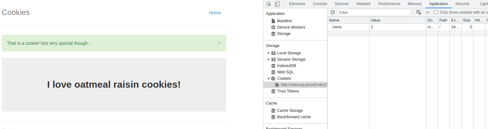
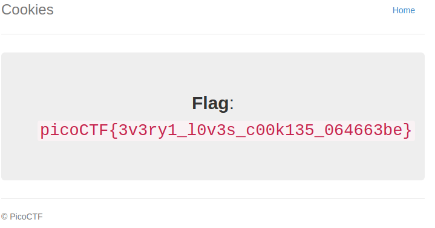

# How to slove this

URL soal: https://play.picoctf.org/practice/challenge/173?category=1&page=1

1. Buka link web yang da pada deskripsi (http://mercury.picoctf.net:27177/).
2. Coba input apa saja/ terserah. Dan ternyata menghasilkan tampilan berikut. 

3. Disini saya mencoba untuk melihat source code, namun tidak ada yang mencurigakan.
4. Kemudian, saya menginputkan sesuai dengan placeholder form yaitu "snickerdoodle".
5. Responnya seperti berikut.
 
6. Kemudian, saya mengecek source codenya namun tidak ada yang mencurigakan. Namun, disini sepertinya petunjuknya adalah pada *cookie* sesuai dengan judul dan deskripsi soal. 

7. Dan saat saya mengubah nilai variabel *name* dari cookie menjadi nilai yang lain dan lakukan refresh web, ternyata tampilan web berubah-ubah seperti berikut. 
 

8. Lalu saya menggunakan burp suite untuk melakukan intruder dengan payload 1-20.
9. Apabila sudah selesai pilih *length* yang berbeda dan itu terdapat pada value ke 18. 

### Flag
>picoCTF{3v3ry1_l0v3s_c00k135_064663be}