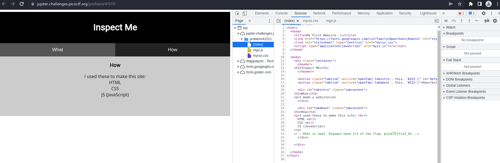

# How to slove this

URL soal: https://play.picoctf.org/practice/challenge/18?category=1&page=1

1. Buka link yang terdapat pada deskripsi soal.
2. Petunjuk terdapat di menu *How* website.  

3. Lakukan *inspect* sesuai dengan perintah soal. Dan ternyata terdapat flag pada file html.  

4. Lihat juga file css dan javascriptnya.  
  

5. Flag berhasil didapatkan.

### Flag
>picoCTF{tru3_d3t3ct1ve_0r_ju5t_lucky?832b0699}