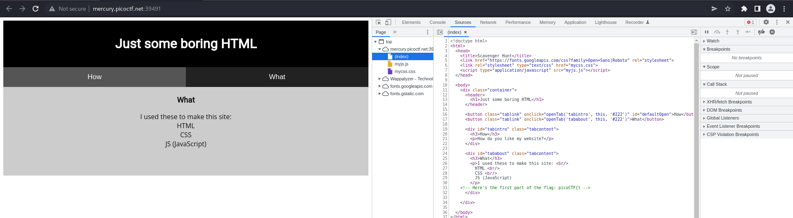
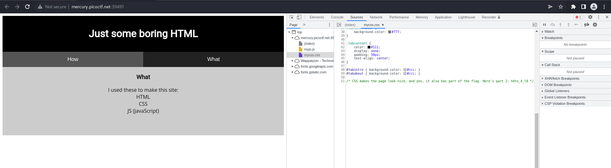
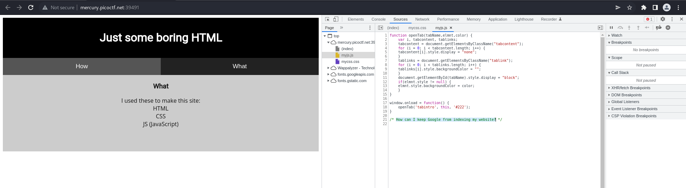
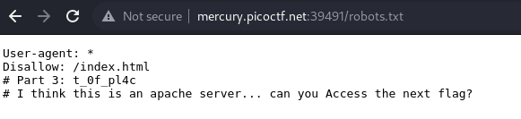
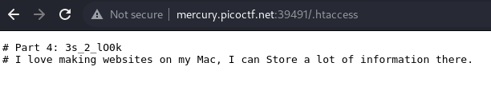
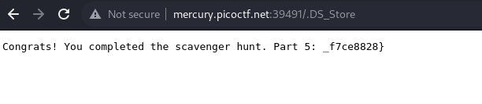

# How to slove this

URL soal: https://play.picoctf.org/practice/challenge/161?category=1&page=1

1. Buka link yang ada pada deskripsi soal.
2. Saat membuka website terdapat petunjuk bahwa developer membuat website menggunakan HMTL, CSS, dan JS. Maka dari itu saya membuka source code dari HTML. Dan flag bagian pertama didapatkan.  

3. Kemudian, saya membuka source code file CSS. Dan flag bagian kedua didapatkan.  

4. Kemudian, saya membuka source code file JS. Di sini saya tidak mendapatkan flag namun terdapat petunjuk bagaimana google mengindex suatu website. Jadi saya membuka file `robots.txt`. File robots.txt adalah dokumen yang memberi tahu mesin telusur halaman mana yang boleh ditampilkan dan tidak boleh ditampilkan di hasil mesin telusur mereka atau melarang mesin telusur tertentu merayapi situs web sama sekali. Ini bisa menjadi praktik umum untuk membatasi area situs web tertentu sehingga tidak ditampilkan di hasil mesin pencari. Halaman-halaman ini dapat berupa area seperti portal administrasi atau file yang ditujukan untuk pelanggan situs web. File ini memberi kami daftar lokasi yang bagus di situs web yang pemiliknya tidak ingin kami temukan sebagai penguji penetrasi. Dan flag ketiga berhasil didapatkan.  
  

5. Pentunjuk sebelumnya adalah tentang apache server. Maka dari itu saya membuka direktori `.htaccess`. Dan flag bagian keempat didapatkan. `.htaccess` umumnya hanya disediakan pada web server yang menggunakan jenis Apache. 

6. Pada langkah sebelumnya kita mendapatkan petunjuk tentang penyimpanan pada macOS. Maka dari itu saya membuka `.DS_Store`. DS_Store adalah file MacOS khusus yang menyimpan informasi tentang folder saat ini. Seperti pemosisian ikon, dll. Anda juga dapat melihatnya jika Anda membuka zip file dari pengguna Mac di komputer non-Mac. Jenis pengidentifikasi token komputer Mac. Dan flag kelima didapatkan.  

### Flag
>picoCTF{th4ts_4_l0t_0f_pl4c3s_2_lO0k_f7ce8828}