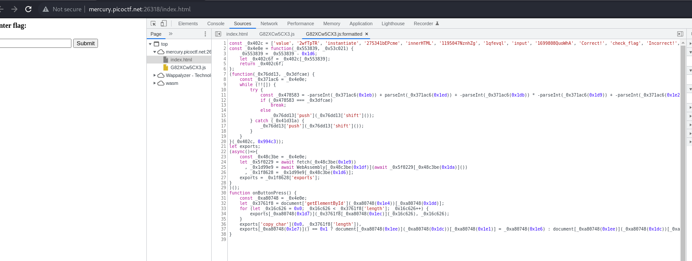
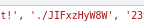
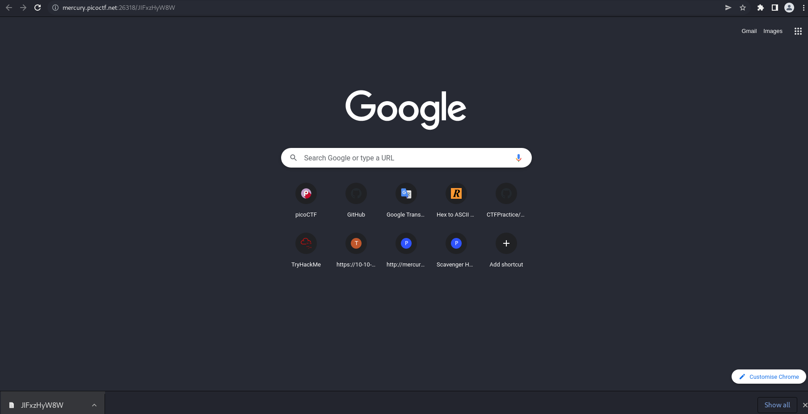
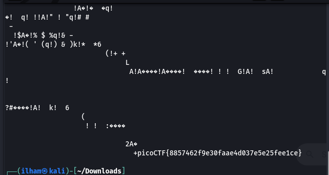

# How to slove this

URL soal: https://play.picoctf.org/practice/challenge/152?category=1&page=1

1. Buka link yang ada dideskripsi soal.
2. Lihat inspect untuk melihat source code websitenya.
3. Ternyata pada source code JS nama variabelnya menggunakan hexcadecimal. Mengingat dengan rendahnya poin yang didapat kemungkinan disini kita tidak perlu untuk reverse enginering.  

4. Terdapat hal mencurigakan pada variabel `_0x402c` karena terdapat `'./JIFxzHyW8W'` yang kemungkinan ini mengarah ke suatu direktori pada website tersebut.  

5. Ternyata saat dimasuki, browser secara otomatis mendownload sebuat file.

6. Buka file tersebut.

7. Flag berhasil didapatkan.
 
### Flag
>picoCTF{8857462f9e30faae4d037e5e25fee1ce}