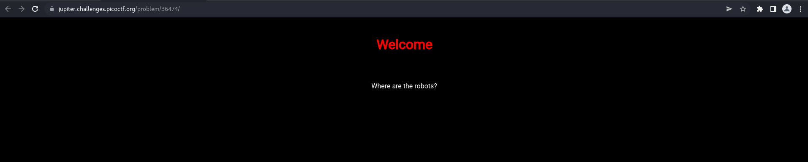
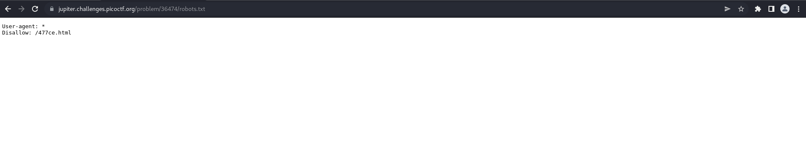
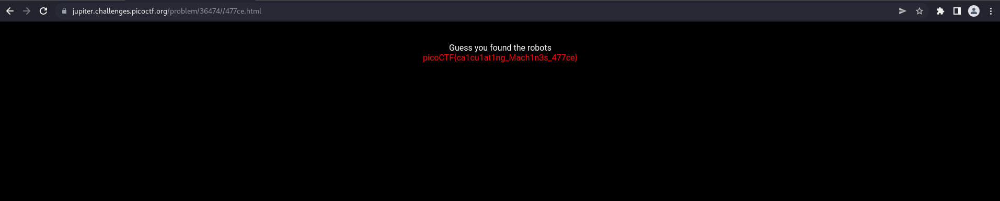

# How to slove this

URL soal: https://play.picoctf.org/practice/challenge/4?category=1&page=1

1. Buka link yang ada di deskripsi soal.
2. Setelah membuka link tersebut, maka akan muncul tampilan website seperti di bawah ini.  

3. Di sini hanya terdapat petunjut `where are the robots`. Saya langsung berpikir tentang file `robots.txt` yang ada di web. File `robots.txt` adalah dokumen yang memberi tahu search engine halaman mana yang boleh dan tidak boleh ditampilkan di hasil search engine mereka atau melarang search engine tertentu merayapi situs web sama sekali. Ini bisa menjadi praktik umum untuk membatasi area situs web tertentu sehingga tidak ditampilkan di hasil search engine. Halaman-halaman ini dapat berupa area seperti portal administrasi atau file yang ditujukan untuk pelanggan situs web. File ini memberi kita daftar lokasi yang bagus di situs web yang pemiliknya tidak ingin kita temukan sebagai penguji penetrasi. Beikut merupakan tampilan website saat membuka file `robots.txt`.  

4. Kita dapat memperoleh informasi alamat sub-direktori yang tidak boleh dotampilkan oleh search engine. Di sini kita dapat buka endpoint tersebut.  

5. Flag berhasil didapatkan.

### Flag
>picoCTF{ca1cu1at1ng_Mach1n3s_477ce}