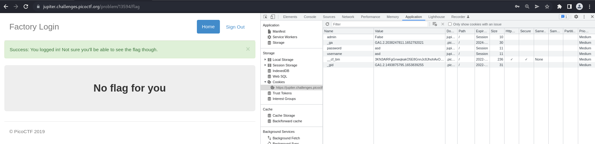
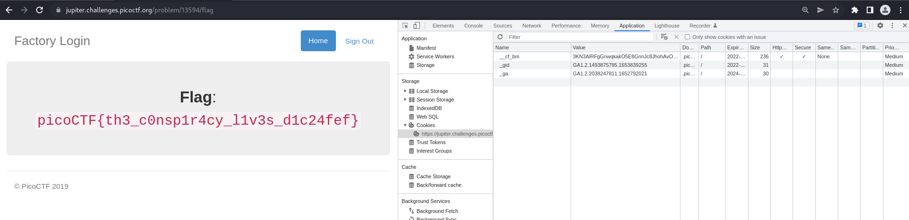

# How to slove this

URL soal: https://play.picoctf.org/practice/challenge/46?category=1&page=1

1. Buka link yang ada dideskripsi soal.
2. Saat saya mencoba login dengan apa saja pasti berhasil sedangkan saat login dengan username `Joe` pasti tidak bisa login.
3. Kemudian saya login dengan sembarang dan mencoba untuk mengecek source codenya. Namun, tidak ada yang mencurigakan.
4. Tetapi saat saya melihat cookie ternyata terdapat variabel `admin` yang bernilai `False`.  

5. Kemudian saya mengubah variabel `admin` menjadi bernilai `True`kemudian merefresh. Dan flah berhasil didapatkan.  

 
### Flag
>picoCTF{th3_c0nsp1r4cy_l1v3s_d1c24fef}