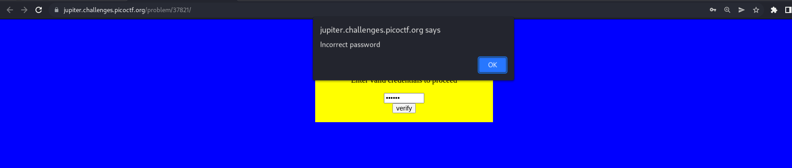
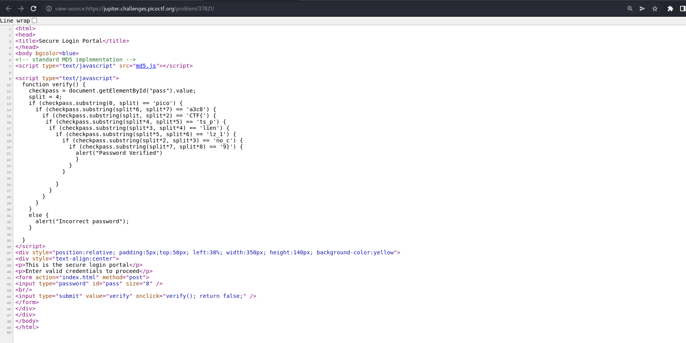
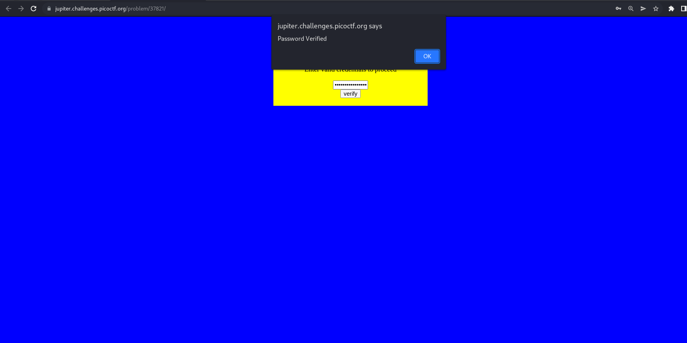

# How to slove this

URL soal: https://play.picoctf.org/practice/challenge/66?category=1&page=1

1. Buka link yang ada dideskripsi soal.
2. Terdapat form untuk mengisi credential. Di sini saya mengsisi dengan sembarang input. Namun, sistem di sini mengembalikan `Incorrect password`. <br>

3. Kemudian, saya mengecek source code dari website tersebut dan sini saya mendapatkan hal yang mencurigakan dari script JS. Dalam script tersebut terdapat flag picoCTF di dalam pengkondisian if/ else, namun flagnya di acak. <br>

4. Kemudian, saya mengurutkan flagnya seperti pada kode di bawah ini. <br>
```bash
    split = 4;
    if (checkpass.substring(0, 4) == 'pico') {                          0 , 4   -
      if (checkpass.substring(4*6, 4*7) == 'a3c8') {                    24, 28  -
        if (checkpass.substring(4, 4*2) == 'CTF{') {                    4 , 8   -
         if (checkpass.substring(4*4, 4*5) == 'ts_p') {                 16, 20  -
          if (checkpass.substring(4*3, 4*4) == 'lien') {                12, 16  -
            if (checkpass.substring(4*5, 4*6) == 'lz_1') {              20, 24  -
              if (checkpass.substring(4*2, 4*3) == 'no_c') {            8 , 12  -
                if (checkpass.substring(4*7, 4*8) == '9}') {            28, 32
                  alert("Password Verified")
                  }
                }
              }
      
            }
          }
        }
      }
    }
```
5. Dan di sini saya mendapatkan flagnya serta mengetes pada web tersebut dan ternyata website merespon `Password Verified`. <br>



### Flag
>picoCTF{no_clients_plz_1a3c89}


