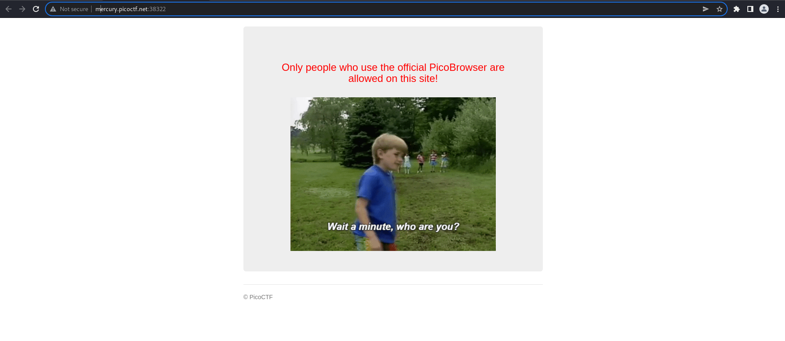
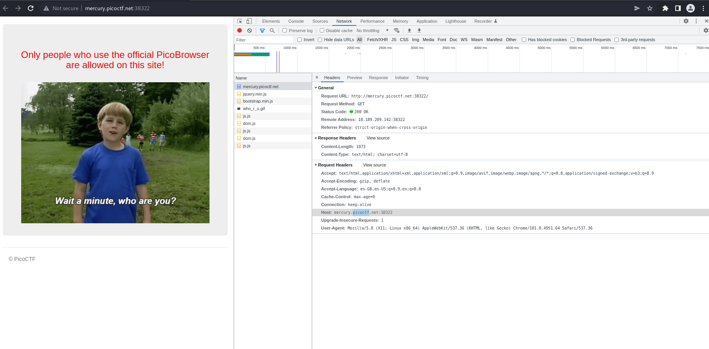
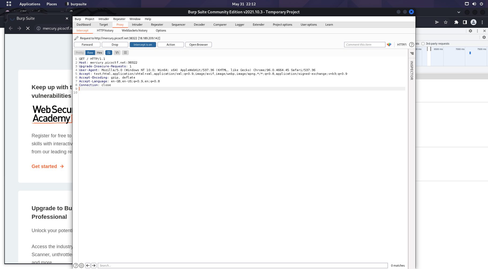
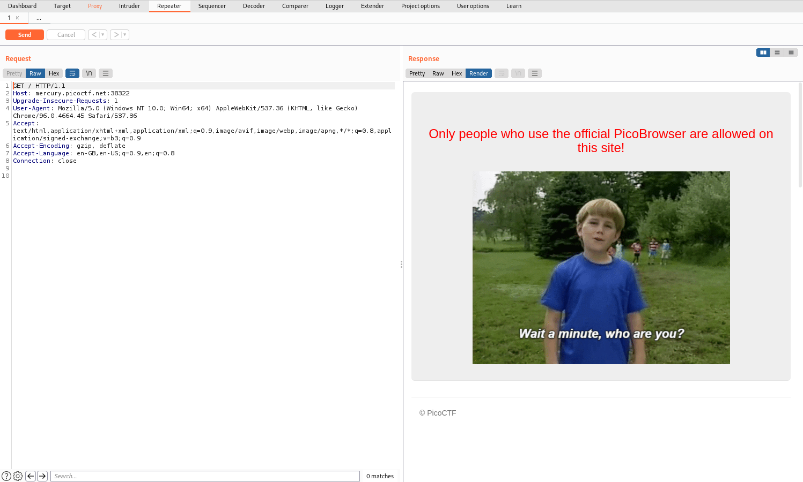
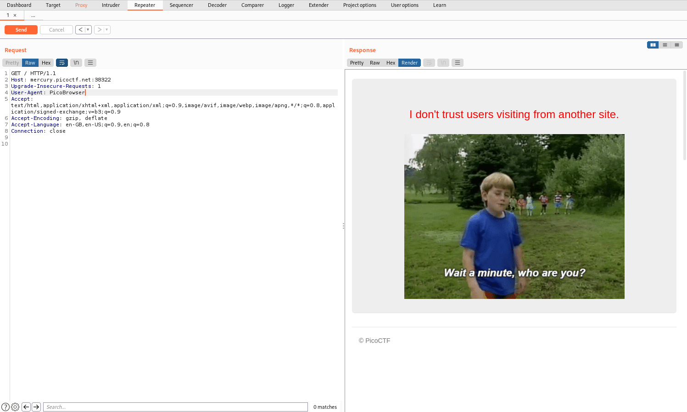
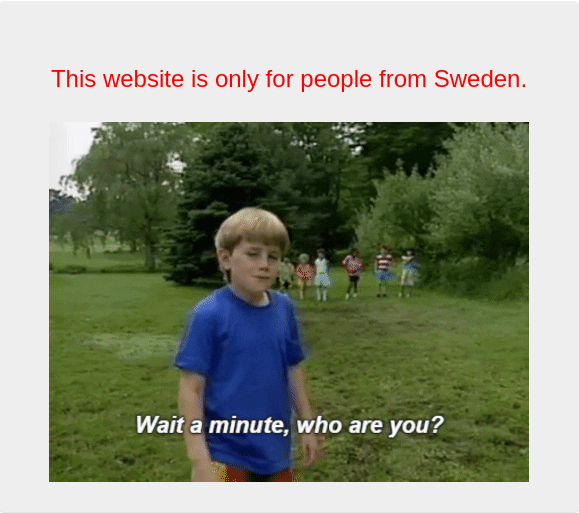
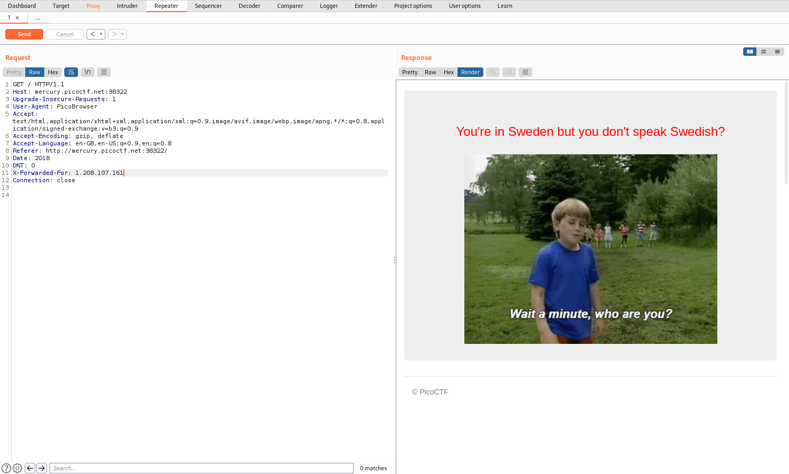
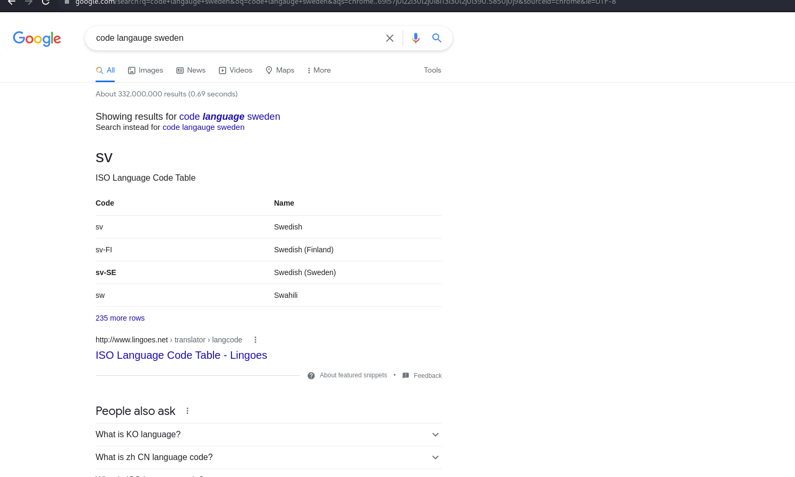
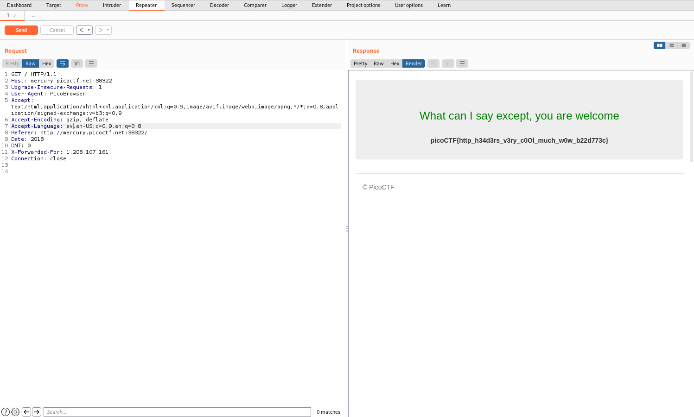

# How to slove this

URL soal: https://play.picoctf.org/practice/challenge/142?category=1&page=1

1. Buka link yang di deskripsi soal.
2. Berikut merupakan tampilan dari browsernya.  

3. Kemudian, saya membuka source codenya namun tidak ada yang mencurigakan. Petunjuknya hanya ***"Only people who use the official PicoBrowser are allowed on this site!***.  

4. Jadi, saya membuka *burp suite* agar dapat mengedit ***request headernya***.   

5. Kemudian saya kirim request header yang ditangkap burp suite ke repeater burp suite.  

Karena petunjuknya adalah hanya orang yang menggunakan PicoBrowser maka kita modifikasi ***User-Agent***. [Penjelasan User-Agent](https://developer.mozilla.org/en-US/docs/Web/HTTP/Headers/User-Agent). Maka dari itu, kita ganti menjadi `User-Agent: PicoBrowser` dan *send*.      
6. Kemudian, muncul petunjuk baru berupa ***"I don't trust users visiting from another site."***.  

Jadi, kita perlu menambahkan header ***Referer***. [Penjelasan Referer](https://developer.mozilla.org/en-US/docs/Web/HTTP/Headers/Referer). Berikut kodenya `Referer: http://mercury.picoctf.net:38322/`.
7. Setelah itu muncul petunjuk baru, yaitu ***Sorry, this site only worked in 2018***.  

Maka kita tambahkan ***Date*** pada *request headernya*. [Penjelasan Date](https://developer.mozilla.org/fr/docs/Web/HTTP/Headers/Date). Tambahkan *request* berikut `Date: 2018`.
8. Kemudian muncul petunjuk baru yaitu ***I don't trust users who can be tracked***.  

Maka dari itu kita perlu menambahkan ***DNT***. [Penjelasan DNT](https://developer.mozilla.org/fr/docs/Web/HTTP/Headers/DNT). Tambahkan *request* berikut `DNT: 0`.
9. Kemudian muncul petunjuk baru yaitu ***This website is only for people from Sweden***.  
  
Maka dari itu kita perlu menambahkan ***X-Forwarded-For***. [Penjelasan X-Forwarded-For](https://developer.mozilla.org/en-US/docs/Web/HTTP/Headers/X-Forwarded-For). Tambahkan *request* berikut `X-Forwarded-For: 1.208.107.161`.  
  
10. Kemudian muncul petunjuk baru yaitu ***You're in Sweden but you son't speak Swedish?***.  
Maka kita harus memodifikasi ***Accept Language*** menjadi bahasa *Sweden*. [Penjelasan Accept Language](https://developer.mozilla.org/fr/docs/Web/HTTP/Headers/Accept-Language). Tambahkan *request* berikut `Accept Language: sv`.  
  
11. Flag berhasil didapatkan.  
  

### Flag
>picoCTF{http_h34d3rs_v3ry_c0Ol_much_w0w_b22d773c}