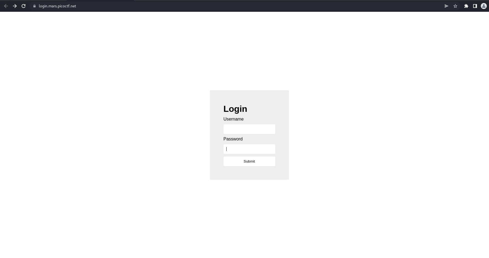
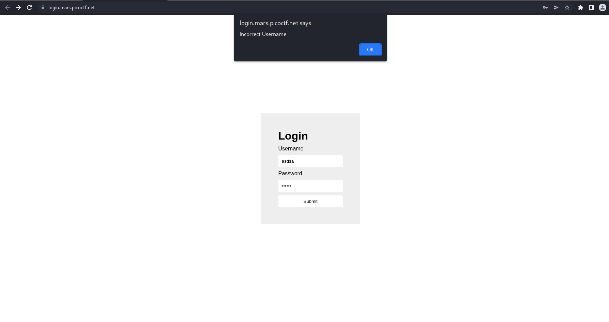
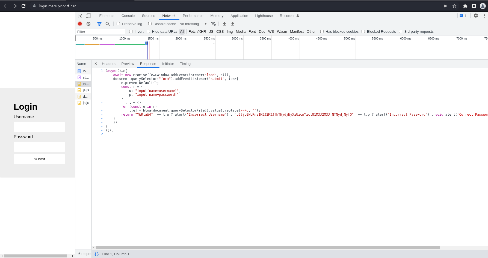

# How to slove this

URL soal: https://play.picoctf.org/practice/challenge/200?category=1&page=1

1. Buka link yang di deskripsi soal. <br>

2. Saya mengiputkan sembarang kata. Respon dari webnya adalah *Incorrect Username*. <br>

3. Kemudian saya mengecek souce code dan terdapat hal yang mencurigakan di source code JavaScriptnya. <br>

4. Kemudian saya mendownload seluruh source code website tersebut dengan command berikut. <br>
```bash
wget --recursive https://login.mars.picoctf.net/
```
5. Berikut adalah code JSnya berserta sedikit penjelasannya. 
```jsx
(async()=>{
    await new Promise((e=>window.addEventListener("load", e))),
    document.querySelector("form").addEventListener("submit", (e=>{
        e.preventDefault();
        const r = {
            u: "input[name=username]",
            p: "input[name=password]"
        }
          , t = {};
        for (const e in r)
            t[e] = btoa(document.querySelector(r[e]).value).replace(/=/g, "");
        return "YWRtaW4" !== t.u ? 
                        alert("Incorrect Username") : "cGljb0NURns1M3J2M3JfNTNydjNyXzUzcnYzcl81M3J2M3JfNTNydjNyfQ" !== t.p ? 
                        alert("Incorrect Password") : void alert(`Correct Password! Your flag is ${atob(t.p)}.`)
    }
    ))
}
)();
```
username = "=YWRtaW4" <br>
password = "c=Gljb0NURns1M3J2M3JfNTNydjNyXzUzcnYzcl81M3J2M3JfNTNydjNyfQ"

.replace(/=/g, ""); --> fungsi built-in dari JS yang berfungsi menggantikan dari "=" menjadi "". Ini bersifat case-sensitif. <br>
btoa() --> fungsi built-in dari JS yang berfungsi encode string dengan base64
asdsad

6. Kemudian saya melakukan decode base64 pada [base64](https://www.base64decode.org/). Dan didapatkan hasil berikut. <br>
```jsx
username = admin
password = picoCTF{53rv3r_53rv3r_53rv3r_53rv3r_53rv3r}
```
7. Flag berhasil didapatkan.


### Flag
>picoCTF{53rv3r_53rv3r_53rv3r_53rv3r_53rv3r}


